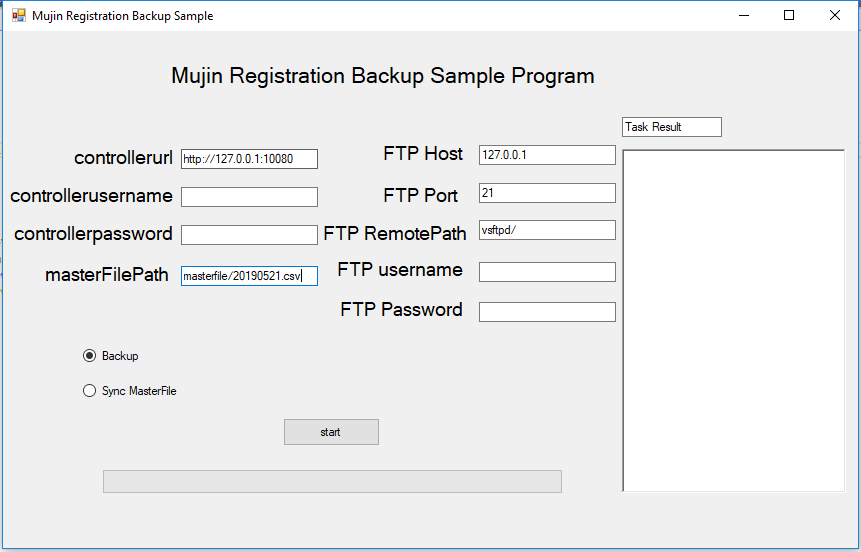

# registrationbackupexample

## Dependencies
1. [Mujin controllerclientcs](https://github.com/mujin/mujincontrollerclientcs)
2. Nuget packages
  * Newtonsoft.Json

## Client 



### Backup 
1. choose the ratio button on 'Backup'
2. Input Mujin controller username/password and FTP username, password and ftpRemotePath to do the backup/restore
3. Click start button

### Sync masterfile
1. choose the ratio button on 'Sync MasterFile'
2. Input Mujin controller username/password and FTP username, password and path
3. Input masterfile path relative to ftpRemotePath.  ( For example, if your ftpRemotePath is ```vsftpd/```,  masterfile path is ```masterfile/20190521.csv```, then the masterfile location is vsftpd/masterfile/20190521.csv(
4. Click Start button
